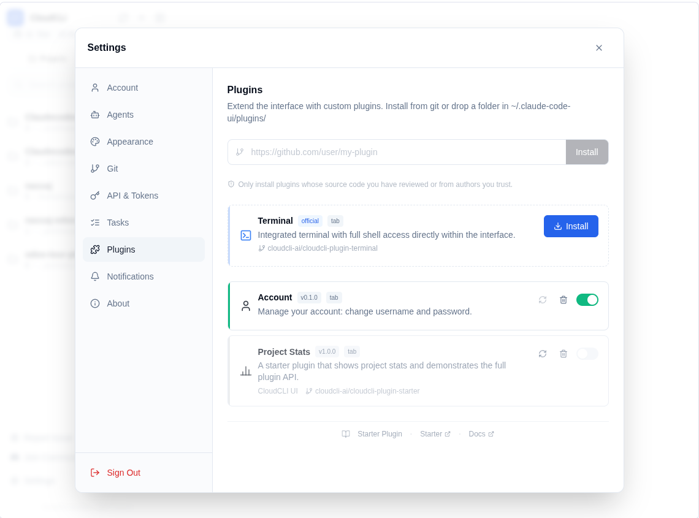
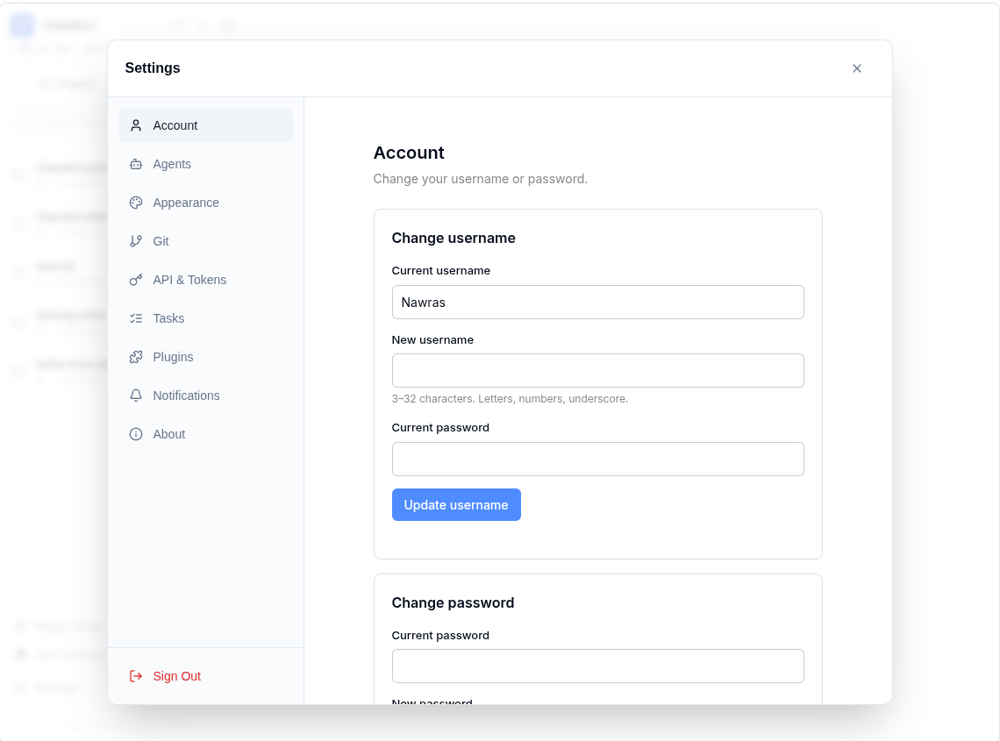
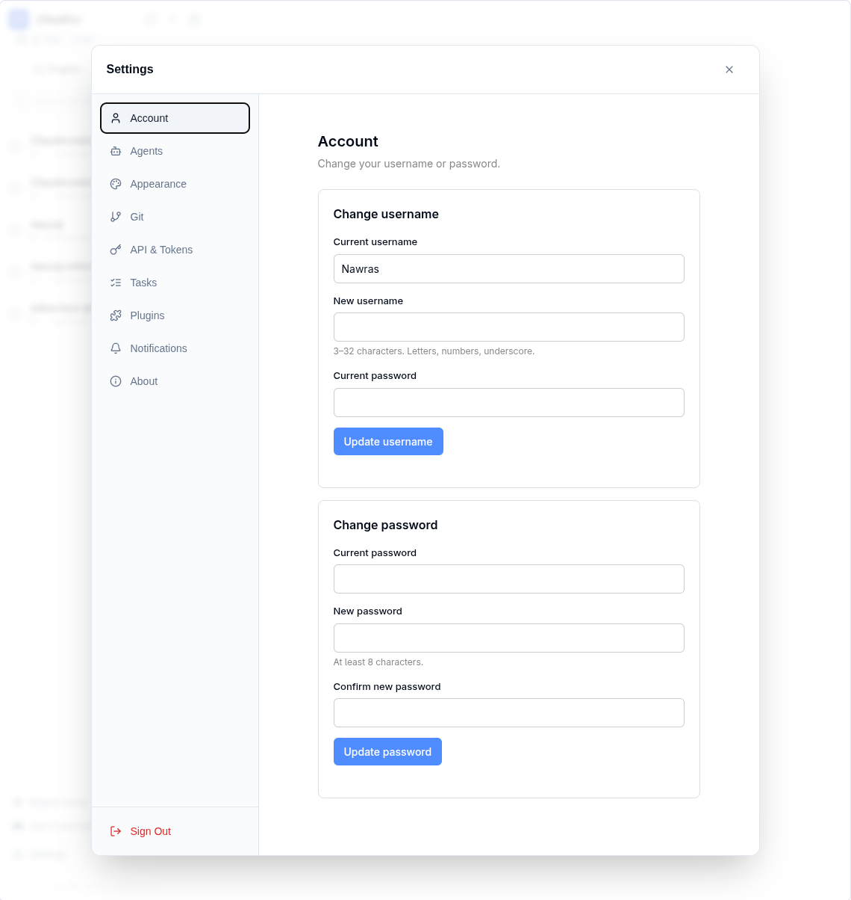

# إضافة إدارة الحساب | Account Plug-in for Claude Code UI

> مشروع مفتوح المصدر من **[نورس](https://alkindy.tech/nawras)** — مبادرة المصادر المفتوحة لـ[الكندي](https://alkindy.tech).
>
> An open source project by **[Nawras](https://alkindy.tech/nawras)** — the open source initiative of **[AlKindy](https://alkindy.tech)**.

[](LICENSE)
[](https://alkindy.tech/nawras)


---

## لقطات | Screenshots

|  |  |  |
|:-:|:-:|:-:|
| الإضافة بعد التثبيت | تبويب الحساب | تغيير اسم/كلمة المرور |

> اللقطات تُظهر الإضافة مدمجةً داخل صفحة الإعدادات (تكامل اختياري). افتراضياً تظهر الإضافة تبويباً مستقلاً في الشريط العلوي. راجع `host-ui-integration/` للحصول على هذا التكامل.
>
> Screenshots show the plug-in integrated inside Settings (optional). By default it appears as a top-level tab. See `host-ui-integration/` to reproduce the look.

---

## 🇸🇦 العربية

### نظرة عامة
إضافة بسيطة لـ[Claude Code UI](https://github.com/cloudcli-ai/cloudcli-ui) تُتيح للمستخدم في النشر الذاتي تغيير **اسم المستخدم** و**كلمة المرور** من داخل التطبيق. بطاقتان فقط، بلا توسيع غير ضروري.

### المميزات
- تغيير اسم المستخدم (يتطلب كلمة المرور الحالية، النمط: `^[a-zA-Z0-9_]{3,32}$`)
- تغيير كلمة المرور (يتطلب الحالية، الجديدة ≥ 8 محارف، bcrypt cost 12)
- تجديد JWT بعد كل تغيير ناجح
- ترجمة عربية وإنجليزية
- ينضبط على وضع المنصة (`IS_PLATFORM=true`) → تُعطَّل الواجهات بلطف

### المتطلبات
- نشر ذاتي لـClaude Code UI تتحكم بكوده
- Node.js ≥ 18 لبناء الإضافة
- تطبيق **server patch** على الـhost (انظر [`server-patch/`](server-patch/README.md))

### التثبيت

#### 1) طبّق server patch (مرة واحدة)
من جذر مستودع الـhost:
```bash
git apply path/to/plugins/account/server-patch/auth-routes.patch
git apply path/to/plugins/account/server-patch/users-repository.patch
```
أعد تشغيل الخادم.

#### 2) ثبّت الإضافة
```bash
git clone https://github.com/Nawras-io/claudecodeui-plugin-account
cd claudecodeui-plugin-account
npm install
npm run build

mkdir -p ~/.claude-code-ui/plugins
ln -sfn "$(pwd)" ~/.claude-code-ui/plugins/account
```

#### 3) فعّل
داخل التطبيق: **Settings → Plugins** → فعّل **Account**. سيظهر تبويب **Account** في الشريط الرئيسي.

### تكامل Settings (اختياري)
لجعل الإضافة تظهر داخل صفحة الإعدادات (كما في اللقطات)، طبّق patches في [`host-ui-integration/`](host-ui-integration/README.md).

### المساهمة
نرحّب بالمساهمات. اطّلع على [CONTRIBUTING.md](CONTRIBUTING.md) و[ميثاق السلوك](CODE_OF_CONDUCT.md).

### الأمان
لبلاغات الثغرات: [SECURITY.md](SECURITY.md) أو `security@alkindy.tech`.

### الترخيص
Apache 2.0 — راجع [LICENSE](LICENSE) و[NOTICE](NOTICE).

---

## 🇬🇧 English

### Overview
A minimal plug-in for [Claude Code UI](https://github.com/cloudcli-ai/cloudcli-ui) that lets a self-hosted user change their **username** and **password** from inside the app. Two cards, no extra surface area.

### Features
- Change username (current password required, pattern `^[a-zA-Z0-9_]{3,32}$`)
- Change password (current required, new ≥ 8 chars, bcrypt cost 12)
- Refreshed JWT after each successful change
- i18n: English + Arabic
- Platform-mode aware (`IS_PLATFORM=true` → endpoints return `403`)

### Requirements
- A self-hosted Claude Code UI instance you control
- Node.js ≥ 18 to build
- One-time **server patch** applied to the host (see [`server-patch/`](server-patch/README.md))

### Install

#### 1) Apply the server patch (one-time)
From the host repo root:
```bash
git apply path/to/plugins/account/server-patch/auth-routes.patch
git apply path/to/plugins/account/server-patch/users-repository.patch
```
Restart the server.

#### 2) Install the plug-in
```bash
git clone https://github.com/Nawras-io/claudecodeui-plugin-account
cd claudecodeui-plugin-account
npm install
npm run build

mkdir -p ~/.claude-code-ui/plugins
ln -sfn "$(pwd)" ~/.claude-code-ui/plugins/account
```

#### 3) Enable
In-app: **Settings → Plugins** → toggle **Account** on. An **Account** tab appears in the main bar.

### Settings integration (optional)
To render the plug-in inside the Settings page (as in the screenshots), apply the patches under [`host-ui-integration/`](host-ui-integration/README.md).

### Endpoints used
| Endpoint                       | Provided by       | Method |
| ------------------------------ | ----------------- | ------ |
| `/api/auth/user`               | upstream host     | GET    |
| `/api/auth/account/username`   | this server-patch | PUT    |
| `/api/auth/account/password`   | this server-patch | PUT    |

### Project layout
```
plugins/account/
├── manifest.json           # Host plug-in manifest
├── package.json            # Build script (esbuild)
├── tsconfig.json
├── user.svg                # Tab icon
├── src/                    # mount/unmount entry, api, i18n, ui
├── dist/index.js           # Pre-built ESM bundle (~11 kB)
├── docs/screenshots/
├── server-patch/           # Backend additions (host)
└── host-ui-integration/    # Optional UI integration into Settings
```

### Security model
- All endpoints require a valid Bearer token (host's `authenticateToken`).
- Both changes require the current password — defends against in-memory token theft.
- bcrypt cost 12 (matches the host).
- DB enforces username uniqueness; route maps SQLite `UNIQUE` to `409`.
- Disabled in platform mode.
- **Audit logging is not added** — wire your own if PDPL / SOX applies.

### Contributing
Contributions are welcome. See [CONTRIBUTING.md](CONTRIBUTING.md) and the [Code of Conduct](CODE_OF_CONDUCT.md).

### Security
For vulnerability reports: [SECURITY.md](SECURITY.md) or `security@alkindy.tech`.

### License
Apache 2.0 — see [LICENSE](LICENSE) and [NOTICE](NOTICE).

---

<p align="center">
  صُنع بـ ♥ في نورس · جزء من الكندي<br>
  Built with ♥ at Nawras · Part of AlKindy
</p>
